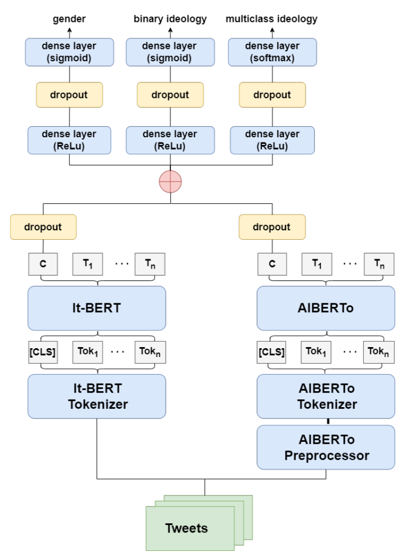

# PoliticIT: Predicting Political Ideology and Gender from Italian Tweets

A multi-output deep learning model for automatic detection of **self-assigneded gender** as demographic trait and **political ideology** as a psychographic trait from Italian tweets.  
Developed for the [PoliticIT Challenge @ EVALITA 2023](https://evalita.it/campaigns/evalita-2023/tasks/politicit).




---

## Installation

Clone the repository and install the dependencies:

```bash
git clone https://github.com/leeeov4/politicit-model.git
cd politicit-model
pip install -r requirements.txt
```


## Usage

```python
from politicit_model import PoliticITModel
from politicit_model.utils import print_prediction

model = PoliticITModel()
result = model.predict("Oggi, sabato 31 dicembre, alle ore 9.34, nel Monastero Mater Ecclesiae in Vaticano, il Signore ha chiamato a Sé il Santo Padre Emerito Benedetto XVI.")

model.print_prediction(result)
```

Sample Output:

```matlab
Gender:
  - Male: 33.85%     [===       ]
  - Female: 66.15%   [======    ]

Political ideology (binary):
  - Left: 71.65%     [=======   ]
  - Right: 28.35%    [==        ]

Political ideology (multiclass):
  - 'Left': 36.18%             [===       ]
  - 'Right': 29.54%            [==        ]
  - 'Moderate left': 9.92%     [          ]
  - 'Moderate right': 24.36%   [==        ]
```

The `predict()` method returns a tuple of 3 arrays:
```python
gender_probabilities: [male_prob]
binary_ideology_probabilities: [right_prob]
multiclass_ideology_probabilities: [[left, right, moderate_left, moderate_right]]
```
You can use `print_prediction()` for a nicely formatted summary.

## Methodology

The model is built on two pre-trained BERT models for Italian:


- `dbmdz/bert-base-italian-xxl-cased`
- `polignano-uniba/bert_uncased_L-12_H-768_A-12_italian_alb3rt0` (ALBERTo)

Steps followed:
1) Data exploration and preprocessing
2) Fine-tuning a deep neural network that takes BERT and ALBERTo embeddings as input
3) Multi-task prediction:
    - Gender (binary)
    - Political ideology: binary and multi-class


## 🤗 Hugging Face Model
The model is hosted on the Hugging Face Hub:

[leeeov4/PIDIT on Hugging Face](https://huggingface.co/leeeov4/PIDIT)

It includes:
- Trained model
- Tokenizers (`bert_tokenizer`, `alberto_tokenizer`)

The model is automatically downloaded and cached when you instantiate `PoliticITModel`.

## Repository Contents
- `politicit/` – Core Python package (model loading, preprocessing, inference)
- `notebook/` – Jupyter notebooks with: data exploration, hyperparameter tuning and model training, usage example
- `report.pdf` - Full project report detailing the methodology, results, and evaluation